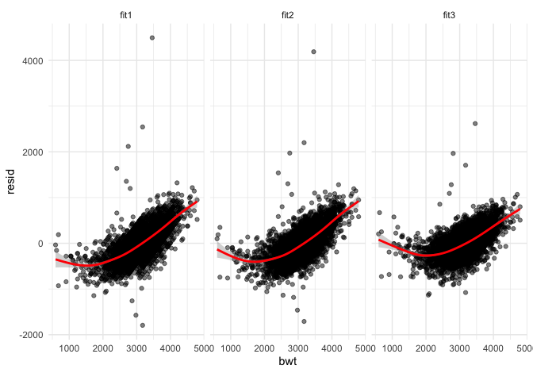

p8105\_hw6\_kb3066
================
Kaila Boyer
11/28/2021

## Problem 1

``` r
birth <- read_csv("birthweight.csv") %>% 
                            janitor::clean_names() %>% 
                            mutate(
                              babysex = as.factor(babysex),
                              babysex = fct_recode(babysex, "Male" = "1", "Female" = "2"),
                              frace = as.factor(frace),
                              frace = fct_recode(frace, "White" = "1", "Black" = "2", "Asian" = "3", 
                                                 "Puerto Rican" = "4", "Other" = "8"),
                              malform = as.logical(malform),
                              mrace = as.factor(mrace),
                              mrace = fct_recode(mrace, "White" = "1", "Black" = "2", "Asian" = "3", 
                                                 "Puerto Rican" = "4"))
```

    ## Rows: 4342 Columns: 20

    ## ── Column specification ────────────────────────────────────────────────────────
    ## Delimiter: ","
    ## dbl (20): babysex, bhead, blength, bwt, delwt, fincome, frace, gaweeks, malf...

    ## 
    ## ℹ Use `spec()` to retrieve the full column specification for this data.
    ## ℹ Specify the column types or set `show_col_types = FALSE` to quiet this message.

``` r
fit1 <- lm(bwt ~ blength + babysex,  data = birth )
fit1 %>% broom::tidy()
```

    ## # A tibble: 3 × 5
    ##   term          estimate std.error statistic   p.value
    ##   <chr>            <dbl>     <dbl>     <dbl>     <dbl>
    ## 1 (Intercept)   -3829.       96.3    -39.7   6.35e-295
    ## 2 blength         140.        1.92    72.7   0        
    ## 3 babysexFemale    -8.67     10.5     -0.829 4.07e-  1

``` r
modelr::add_residuals(birth, fit1) %>% 
  ggplot(aes(y= resid, x = babysex)) +
  geom_point() 
```


``` r
modelr::add_predictions(birth, fit1) %>% 
  ggplot(aes(x = babysex, y = pred)) + 
  geom_point() 
```


The model I proposed was that length at birth and sex of the child help
predict birth weight. Length of an object, particularly an infant, would
likely have a direct relationship with length (a longer baby would
weight more). Sex-differences can be observed with health outcomes, so I
included sex of the baby.

``` r
fit2 <- lm(bwt ~ blength + gaweeks, data = birth)
fit2 %>% broom::tidy()
```

    ## # A tibble: 3 × 5
    ##   term        estimate std.error statistic  p.value
    ##   <chr>          <dbl>     <dbl>     <dbl>    <dbl>
    ## 1 (Intercept)  -4348.      98.0      -44.4 0       
    ## 2 blength        129.       1.99      64.6 0       
    ## 3 gaweeks         27.0      1.72      15.7 2.36e-54

``` r
fit3 <- lm(bwt ~ bhead + blength + babysex + bhead * blength
           + bhead * babysex + blength * babysex + bhead * babysex * blength, data = birth)
fit3 %>% broom::tidy() %>% knitr::kable(digits = 3)
```

| term                        |  estimate | std.error | statistic | p.value |
|:----------------------------|----------:|----------:|----------:|--------:|
| (Intercept)                 | -7176.817 |  1264.840 |    -5.674 |   0.000 |
| bhead                       |   181.796 |    38.054 |     4.777 |   0.000 |
| blength                     |   102.127 |    26.212 |     3.896 |   0.000 |
| babysexFemale               |  6374.868 |  1677.767 |     3.800 |   0.000 |
| bhead:blength               |    -0.554 |     0.780 |    -0.710 |   0.478 |
| bhead:babysexFemale         |  -198.393 |    51.092 |    -3.883 |   0.000 |
| blength:babysexFemale       |  -123.773 |    35.119 |    -3.524 |   0.000 |
| bhead:blength:babysexFemale |     3.878 |     1.057 |     3.670 |   0.000 |

Visual comparison of models (residuals and predictions)

``` r
birth %>% 
  gather_predictions(fit1, fit2, fit3) %>% 
  mutate(model = fct_inorder(model)) %>%  
  ggplot(aes(x = bwt, y = pred)) + 
  geom_point(alpha = .5) +
  geom_smooth( color = "red") + 
  facet_grid(~model)
```

    ## `geom_smooth()` using method = 'gam' and formula 'y ~ s(x, bs = "cs")'


``` r
birth %>% 
  gather_residuals(fit1, fit2, fit3) %>% 
  mutate(model = fct_inorder(model)) %>%  
  ggplot(aes(x = bwt, y = resid)) + 
  geom_point(alpha = .5) +
  geom_smooth( color = "red") + 
  facet_grid(~model)
```

    ## `geom_smooth()` using method = 'gam' and formula 'y ~ s(x, bs = "cs")'



Comparison and cross-validation of models

``` r
cv_df <- crossv_mc(birth, 1000) %>% 
  mutate(
    train = map(train, as_tibble), 
    test = map(test, as_tibble)
  )

cv_df = 
  cv_df %>% 
  mutate(
    fit1_mod = map(train, ~lm(bwt ~ blength + smoken + mrace, data = .x)),
    fit2_mod = map(train, ~lm(bwt ~ blength + gaweeks, data = .x)),
    fit3_mod = map(train, ~lm(bwt ~ bhead + blength + babysex + bhead * blength + bhead * babysex + 
                              blength * babysex + bhead * babysex * blength, data = .x))) %>% 
  mutate(
    rmse_fit1 = map2_dbl(fit1_mod, test, ~rmse(model = .x, data = .y)),
    rmse_fit2 = map2_dbl(fit2_mod, test, ~rmse(model = .x, data = .y)),
    rmse_fit3 = map2_dbl(fit3_mod, test, ~rmse(model = .x, data = .y)))

cv_df %>% 
  select(starts_with("rmse")) %>% 
  pivot_longer(
    everything(),
    names_to = "model", 
    values_to = "rmse",
    names_prefix = "rmse_") %>% 
  mutate(model = fct_inorder(model)) %>% 
  ggplot(aes(x = model, y = rmse)) + geom_violin()
```


## Problem 2

``` r
weather_df = 
  rnoaa::meteo_pull_monitors(
    c("USW00094728"),
    var = c("PRCP", "TMIN", "TMAX"), 
    date_min = "2017-01-01",
    date_max = "2017-12-31") %>%
  mutate(
    name = recode(id, USW00094728 = "CentralPark_NY"),
    tmin = tmin / 10,
    tmax = tmax / 10) %>%
  select(name, id, everything())
```

    ## Registered S3 method overwritten by 'hoardr':
    ##   method           from
    ##   print.cache_info httr

    ## using cached file: ~/Library/Caches/R/noaa_ghcnd/USW00094728.dly

    ## date created (size, mb): 2021-03-22 17:09:07 (7.559)

    ## file min/max dates: 1869-01-01 / 2021-03-31

Bootstrap estimates

``` r
boot_sample = function(df) {
  sample_frac(df, replace = TRUE)
}

weather_bootstraps = 
  data_frame(
    strap_number = 1:5000,
    strap_sample = rerun(5000, boot_sample(weather_df)))
```

    ## Warning: `data_frame()` was deprecated in tibble 1.1.0.
    ## Please use `tibble()` instead.
    ## This warning is displayed once every 8 hours.
    ## Call `lifecycle::last_lifecycle_warnings()` to see where this warning was generated.

``` r
results <-weather_bootstraps %>%  
                    mutate(
                        models = map(strap_sample, ~lm(tmax ~ tmin, data = .x) ),
                        results = map(models, broom::tidy)) %>% 
                    select(-strap_sample, -models) %>% 
                    unnest(results) 

head(results) %>% knitr::kable()
```

| strap\_number | term        | estimate | std.error | statistic | p.value |
|--------------:|:------------|---------:|----------:|----------:|--------:|
|             1 | (Intercept) | 7.280431 | 0.2365421 |  30.77858 |       0 |
|             1 | tmin        | 1.024939 | 0.0178459 |  57.43282 |       0 |
|             2 | (Intercept) | 6.812213 | 0.2112846 |  32.24189 |       0 |
|             2 | tmin        | 1.048376 | 0.0152873 |  68.57822 |       0 |
|             3 | (Intercept) | 6.896866 | 0.2403492 |  28.69519 |       0 |
|             3 | tmin        | 1.054587 | 0.0177265 |  59.49211 |       0 |

``` r
results %>% 
  group_by(term) %>% 
  summarize(
    ci_lower = quantile(estimate, 0.025), 
    ci_upper = quantile(estimate, 0.975)) %>% 
  knitr::kable()
```

| term        | ci\_lower | ci\_upper |
|:------------|----------:|----------:|
| (Intercept) |  6.737914 |  7.724037 |
| tmin        |  1.005337 |  1.072535 |

R-squared values

``` r
boot_rsqd <- weather_bootstraps %>%  
                        mutate(
                            models = map(strap_sample, ~lm(tmax ~ tmin, data = .x) ),
                            summary = map(models, broom::glance), 
                            results = map(models, broom::tidy)) %>% 
                        select(-strap_sample, -models, -results) %>% 
                        unnest(summary) %>% 
                        select(strap_number, r.squared, adj.r.squared)

head(boot_rsqd) %>% knitr::kable(digits = 3)
```

| strap\_number | r.squared | adj.r.squared |
|--------------:|----------:|--------------:|
|             1 |     0.901 |         0.901 |
|             2 |     0.928 |         0.928 |
|             3 |     0.907 |         0.907 |
|             4 |     0.915 |         0.915 |
|             5 |     0.917 |         0.916 |
|             6 |     0.919 |         0.919 |

log(B0\*B1) values

``` r
logb_df <- results %>% 
                  select(-std.error, -statistic, -p.value) %>% 
                  pivot_wider(
                    names_from = term, 
                    values_from = estimate) %>% 
                  rowwise(strap_number) %>% 
                  mutate(
                    B0B1 = `(Intercept)` * tmin, 
                    logB0B1 = log(B0B1)) %>% 
                  select(strap_number, logB0B1) 

head(logb_df) %>% knitr::kable(digits = 3)
```

| strap\_number | logB0B1 |
|--------------:|--------:|
|             1 |   2.010 |
|             2 |   1.966 |
|             3 |   1.984 |
|             4 |   2.057 |
|             5 |   1.985 |
|             6 |   2.021 |

Confidence intervals for r-squared and log(B0\*B1)

``` r
combined_df <- full_join(boot_rsqd, logb_df, by = "strap_number")

combined_df <- combined_df %>% 
                      pivot_longer(cols = !strap_number, 
                                   names_to = "measure", 
                                   values_to = "estimate") %>% 
                      group_by(measure) %>% 
                      summarize(
                        ci_lower = quantile(estimate, 0.025), 
                        ci_upper = quantile(estimate, 0.975))

head(combined_df) %>% knitr::kable(digits = 3)
```

| measure       | ci\_lower | ci\_upper |
|:--------------|----------:|----------:|
| adj.r.squared |     0.894 |     0.927 |
| logB0B1       |     1.967 |     2.060 |
| r.squared     |     0.894 |     0.928 |

## Graph of bootstrap samples

``` r
weather_bootstraps %>% 
  unnest(strap_sample) %>% 
  ggplot(aes(x = tmin, y = tmax)) + 
  geom_line(aes(group = strap_number), stat = "smooth", method = "lm", se = FALSE, alpha = .1, color = "blue") +
  geom_point(data = weather_df, alpha = .5) + 
  ggpubr::stat_regline_equation(label.y = 50, aes(label = ..rr.label..))
```

    ## `geom_smooth()` using formula 'y ~ x'


The distribution of the boostrap estimates is wider at the low-end of
the distribution (by tmin = -10). The distribution narrows towards the
higher end of the distribution (around tmin = 10 - 18 adn tmax = 18 -
25). At the highest end, the distribution appears to start widening
again.
